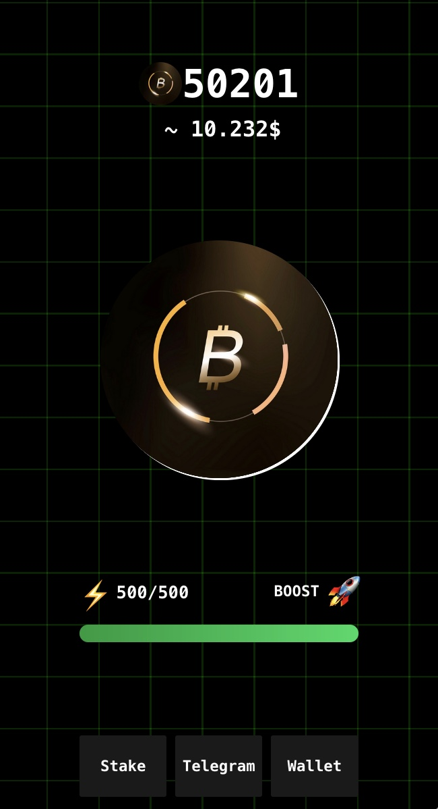

# B-Coin Clicker



B-Coin Clicker is a fun and engaging clicker app built using **React** and styled with **Tailwind CSS**. Designed as a **Telegram Mini App**, it provides a seamless experience for users within the Telegram platform. The app also supports saving progress and data directly in Telegram for convenience and reliability.

---

## Features
- Interactive clicker mechanics.
- Data saved directly in Telegram.
- Sleek and responsive design powered by Tailwind CSS.
- Progressive unlocks and upgrades.
- Easy to navigate UI.
- Optimized for performance with React.

---

## Installation

1. **Clone the repository:**
   ```bash
   git clone https://github.com/your-repo/b-coin-clicker.git
   cd b-coin-clicker
   ```

2. **Install dependencies:**
   ```bash
   npm install
   ```

3. **Start the app:**
   ```bash
   npm start
   ```

   The app will be available at `http://localhost:5173`.
			Or check your console!

---

## Usage

- Launch the app via Telegram as a Mini App.
- Start clicking to earn B-Coins.
- Spend your B-Coins to unlock upgrades and enhance your clicking power.
- Progress is automatically saved within Telegram.

---

## Technologies Used

- **React**: For building the user interface.
- **Tailwind CSS**: For styling and responsive design.
- **JavaScript**: For app logic and interactivity.
- **Telegram API**: For data storage and Mini App integration.

---

## License

This project is licensed under the MIT License.

---

Thank you for checking out **B-Coin Clicker**! Enjoy the game and happy clicking!

